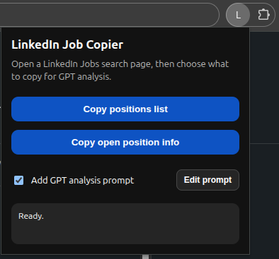
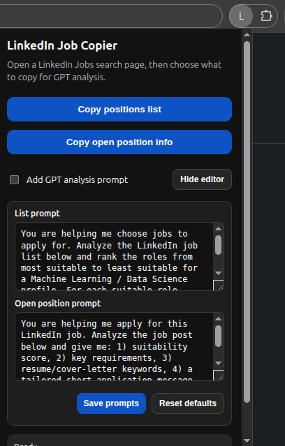

# LinkedIn Job Copier

A small Chrome Manifest V3 extension for copying LinkedIn Jobs data into GPT.

## What it does

- **Copy positions list**: copies the visible job cards from the LinkedIn Jobs results pane.
- **Copy open position info**: copies the currently open job details from the right pane and expands only the job-description `… more` button when LinkedIn renders one.
- If you manually highlight text on the page first, **Copy open position info** copies that selected text exactly.
- **Add GPT analysis prompt** is unchecked by default.
- **Edit prompt** lets you customize and save the list-analysis and open-position prompts.

## Install locally

1. Unzip the extension folder.
2. Open `chrome://extensions` in Chrome.
3. Turn on **Developer mode**.
4. Click **Load unpacked**.
5. Select the unzipped `linkedin-job-copier` folder.
6. Open or reload a LinkedIn Jobs page.
7. Pin the extension and use the two copy buttons.

## Updating from an older version

1. Unzip this new package.
2. In `chrome://extensions`, either remove the old LinkedIn Job Copier and load this folder again, or click **Reload** on the existing unpacked extension after replacing the files.
3. Reload the LinkedIn Jobs tab.

## Version 1.2.0 fixes

- The GPT prompt checkbox now starts unchecked.
- Added a prompt editor with saved custom prompts.
- Made list extraction stricter so feedback cards, footer links, and Premium boxes are excluded.
- Removed the old detail-copy behavior that could scroll the page/list or open LinkedIn's top-card **More** menu.

## Screenshots

  
  

